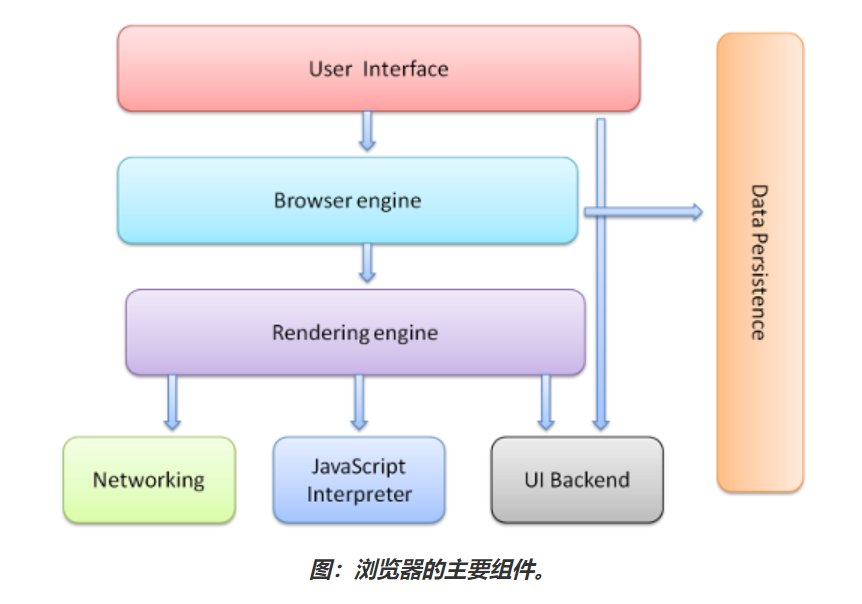

- [1. 浏览器的主要功能](#1-浏览器的主要功能)
- [2. 浏览器的组成](#2-浏览器的组成)

## 1. 浏览器的主要功能

浏览器的主要功能是通过用户输入的 URL(统一资源定位符)向服务器发出请求，并将请求到的资源显示给用户。这里的资源不但包括 HTML 文档，也包括图片，PDF 文档或其他类型的资源。

## 2. 浏览器的组成

一个浏览器的组成部分如下：

- 用户界面

这里的所指的用户界面是除了浏览器用于显示资源的主窗口外，其余的可见用户界面，包括：前进/后退按钮，刷新/停止按钮，主页按钮，导航栏，书签按钮等等。

- 用户界面后端

用于绘制基本的窗口小部件，比如组合框和窗口。其公开了与平台无关的通用接口，而在底层使用操作系统的用户界面方法。

- 浏览器引擎

在用户界面和渲染引擎之间传送指令。

- 渲染引擎

负责显示请求到的资源。如果请求的内容是 HTML，它就负责解析 HTML 和 CSS 资源，并将解析后的内容显示到主窗口上。Chrome 浏览器的每个标签页都分别对应一个渲染引擎实例。每个标签页都是一个独立的进程。

- JavaScript 解释器

用于解析和执行 JavaScript 代码。

- 网络通信

用于网络调用，比如 HTTP 请求。其接口与平台无关，并为所有平台提供底层实现。

- 数据存储

这是持久层。浏览器需要在硬盘上保存各种数据，例如 Cookie，LocalStorage 等。

